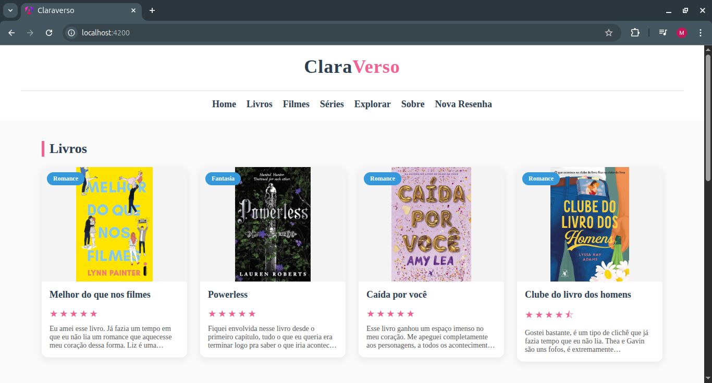
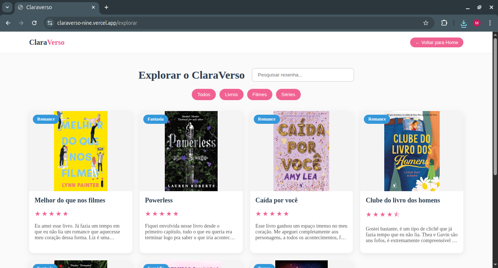
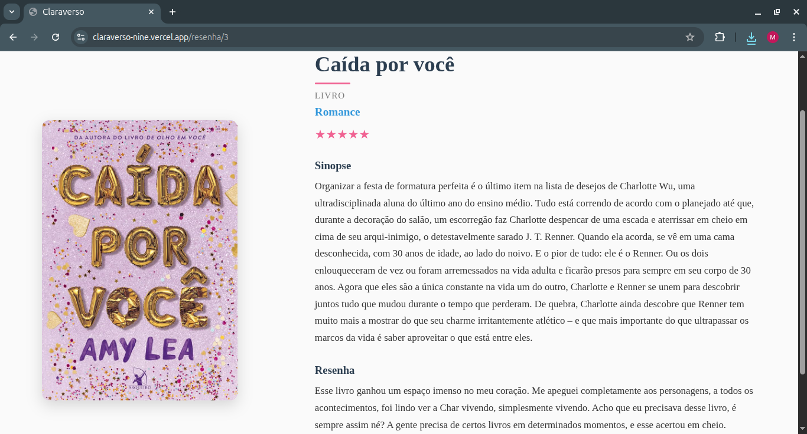
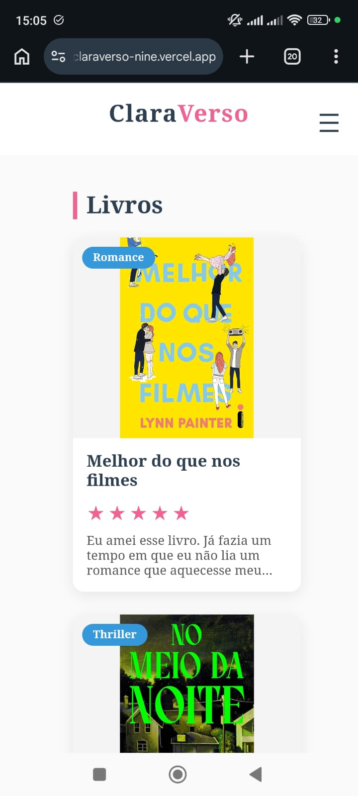
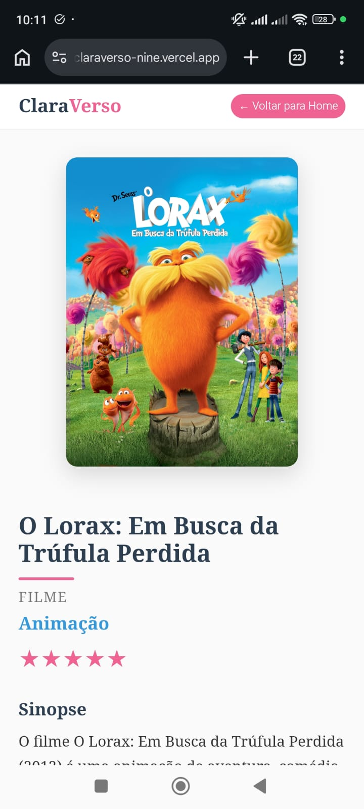

# ClaraVerso - Blog de Resenhas de Livros, Filmes e Séries

Projeto desenvolvido com Angular para exibição de resenhas pessoais de livros, filmes e séries.  

A aplicação permite visualizar uma lista de resenhas e acessar uma página de detalhes dinâmica para cada item.

---

## Tecnologias Utilizadas

- Angular 
- TypeScript
- HTML5
- CSS3

---

## Funcionalidades

- Listagem de resenhas
- Navegação por rota dinâmica (`/resenha/:id`)
- Página de detalhes individual
- Sistema de avaliação com estrelas
- Layout responsivo
- Arquitetura com Service para gerenciamento de dados

---

## Preview

### 💻 Desktop

  
  
  

---

### 📱 Mobile

  
  
  

